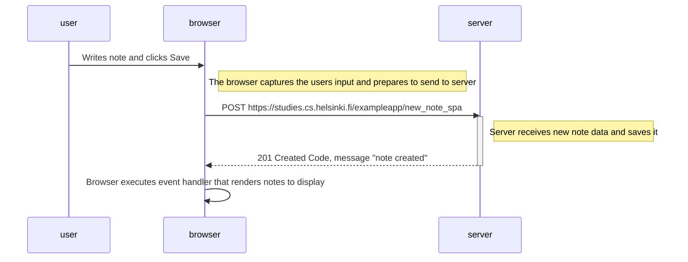

```mermaid

sequenceDiagram
    participant user
    participant browser
    participant server

    user->>browser: Writes note and clicks Save
    Note right of browser: The browser captures the users input and prepares to send to server 

    browser->>server: POST https://studies.cs.helsinki.fi/exampleapp/new_note_spa
    activate server
    Note right of server: Server receives new note data and saves it
    server-->>browser: 201 Created Code, message "note created"
    deactivate server

    browser->>browser: Browser executes event handler that renders notes to display

```